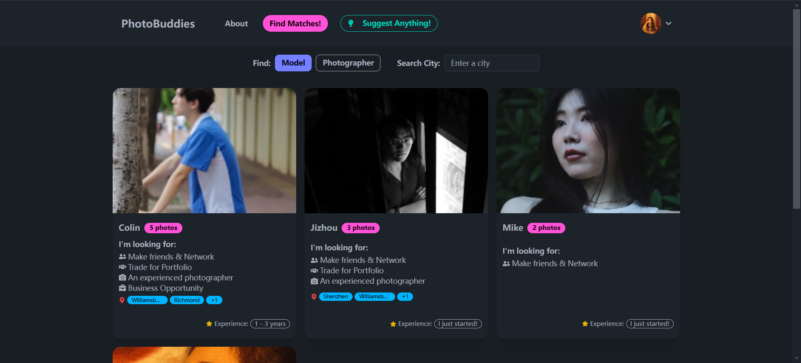

<div align="center">

[English](#english) | [中文](#中文)

</div>

# PhotoBuddies 📸

<div id="english">

> Platform connecting photographers with clients, disrupting the traditional agent-driven market.

<div align="center">
   
   
   *PhotoBuddies Preview*
</div>
<div align="center">
   
   
   *Showcase your portfolio and find matches!*
</div>

## 🌟 Live Demo

Experience PhotoBuddies at [photobuddies.org](http://photobuddies.org)

## 🛠️ Tech Stack

<div align="center">

[](https://reactjs.org/)
[](https://nodejs.org/)
[](https://www.mongodb.com/)
[](https://www.docker.com/)

</div>

## ✨ Features

- 👤 **Profile Management**: Tailored profiles for photographers and models
- 📸 **Portfolio Showcase**: Display your work professionally
- 🔍 **Smart Matching**: Connect with potential clients based on style and location
- 🤝 **Direct Collaboration**: No middleman, no agency fees

## 🚀 Quick Start

```bash
# Clone the repository
git clone https://github.com/yourusername/photobuddies.git

# Navigate to the project directory
cd photobuddies

# Start the application using Docker
docker-compose up --build
```

Access the application at:

- Frontend: http://localhost:3001
- API: http://localhost:4000

## 🤝 Contributing

1. Fork from `dev` branch
2. Create your feature branch
3. Submit a pull request

## 📄 License

This project is licensed under the [MIT License](LICENSE)

</div>

---

<div id="中文">

# PhotoBuddies 📸

## 🌟 在线演示

访问 PhotoBuddies：[photobuddies.org](http://photobuddies.org)

## 🛠️ 技术栈

<div align="center">

[](https://reactjs.org/)
[](https://nodejs.org/)
[](https://www.mongodb.com/)
[](https://www.docker.com/)

</div>

## ✨ 主要功能

- 👤 **信息卡片展示**：为摄影师和模特定制的个性化卡片，展示偏好，风格，价格，联系方式等
- 📸 **作品集展示**：专业的作品展示平台
- 🔍 **智能匹配**：基于风格和地理位置的客户匹配
- 🤝 **无中间商赚差价**：无中介，无代理费

## 🚀 快速开始

```bash
# 克隆仓库
git clone https://github.com/yourusername/photobuddies.git

# 进入项目目录
cd photobuddies

# 使用 Docker 启动应用
docker-compose up --build
```

访问地址：

- 前端：http://localhost:3001
- API：http://localhost:4000

## 🤝 参与贡献

1. 从 `dev` 分支创建 fork
2. 创建您的功能分支
3. 提交 pull request

## 📄 许可证

本项目采用 [MIT 许可证](LICENSE)

</div>
