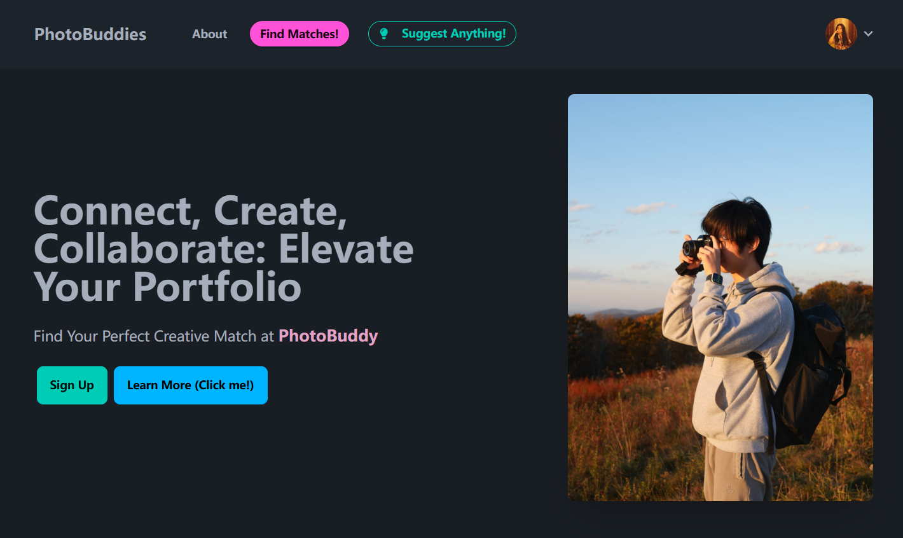

# PhotoBuddies



## Technology Stack

- **Frontend**: React.js ⚛️
- **Backend**: Node.js, Express.js 🟢
- **Database**: MongoDB 🍃
- **Authentication**: SuperTokens 🔐
- **Deployment**: Docker, Docker Compose 🐳

## Introduction

PhotoBuddies is a web application developed using the MERN (MongoDB, Express.js, React.js, Node.js) stack. It aims to connect photographers and models, providing a social platform to help them reach clients more effectively. The project is divided into frontend and backend components and is deployed using Docker containers.

## Features

- **User Profiles**: Create and manage profiles tailored for photographers and models. 👤
- **Portfolio Showcase**: Display your work and skills to attract potential collaborators. 📸
- **Matching System**: Find suitable matches based on location and role. 🔍
- **Secure Authentication**: Powered by SuperTokens for robust user management. 🔒
- **Dockerized Deployment**: Easy setup and deployment using Docker. 🚀

## Purpose

The primary goal of PhotoBuddies is to bridge the gap between photographers and models by offering a dedicated platform for collaboration. It simplifies the process of finding local talent, building portfolios, and expanding professional networks.

## How to Run

1. Ensure Docker is installed and running on your machine.
2. Navigate to the `./PhotoBuddy` directory in your terminal.
3. Run the following command to start the project:
   ```bash
   docker-compose up --build
   ```
4. Access the frontend at [http://localhost:3001](http://localhost:3001).
5. Access the backend API at [http://localhost:4000](http://localhost:4000).

## Live Demo

Check out the live version of PhotoBuddies at [photobuddies.org](http://photobuddies.org).

## GitHub Collaboration Guidelines

1. The `master` branch is the main project branch. Please do not modify it arbitrarily.
2. For new features, fork the `dev` branch and create your own branch. Merge back to `dev` after development is complete.
3. Pull the `dev` branch before starting development to avoid conflicts.

## Technology Stack

- **Frontend**: React.js
- **Backend**: Node.js, Express.js
- **Database**: MongoDB
- **Authentication**: SuperTokens
- **Deployment**: Docker, Docker Compose

## Contribution

Contributions and suggestions are welcome. Please follow the GitHub collaboration guidelines to ensure code quality and project stability.

## License

This project is licensed under the [MIT License](LICENSE).

---

## 项目介绍

PhotoBuddies 是一个基于 MERN (MongoDB, Express.js, React.js, Node.js) 栈开发的 Web 应用，旨在连接摄影师和模特，提供一个社交平台，帮助他们更好地接触客户。项目分为前端和后端部分，并通过 Docker 容器化进行部署。

## 功能

- **用户资料**：创建和管理专为摄影师和模特设计的个人资料。👤
- **作品集展示**：展示您的作品和技能，以吸引潜在的合作者。📸
- **匹配系统**：根据位置和角色找到合适的匹配。🔍
- **安全认证**：由 SuperTokens 提供强大的用户管理。🔒
- **Docker 化部署**：使用 Docker 轻松设置和部署。🚀

## 目的

PhotoBuddies 的主要目标是通过提供一个专用平台来弥合摄影师和模特之间的差距。它简化了寻找本地人才、建立作品集和扩展专业网络的过程。

## 如何运行

1. 确保您的计算机上已安装并运行 Docker。
2. 在终端中进入 `./PhotoBuddy` 目录。
3. 运行以下命令启动项目：
   ```bash
   docker-compose up --build
   ```
4. 访问前端页面：[http://localhost:3001](http://localhost:3001)。
5. 访问后端 API：[http://localhost:4000](http://localhost:4000)。

## 在线演示

查看 PhotoBuddies 的在线版本：[photobuddies.org](http://photobuddies.org)。

## GitHub 协作注意事项

1. `master` 分支是项目主分支，请勿随意修改。
2. 开发新功能时，请 fork `dev` 分支并新建属于自己的分支，开发完成后合并到 `dev` 分支。
3. 每次准备开发前，先 pull 一下 `dev` 分支，避免代码冲突。

## 技术栈

- **前端**：React.js
- **后端**：Node.js, Express.js
- **数据库**：MongoDB
- **认证**：SuperTokens
- **部署**：Docker, Docker Compose

## 贡献

欢迎贡献代码或提出建议。请遵循 GitHub 协作注意事项，确保代码质量和项目稳定性。

## 许可证

本项目采用 [MIT 许可证](LICENSE)。
